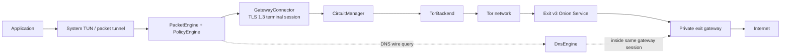
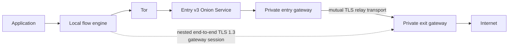
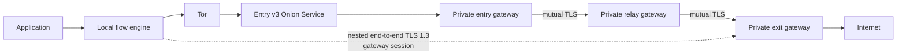
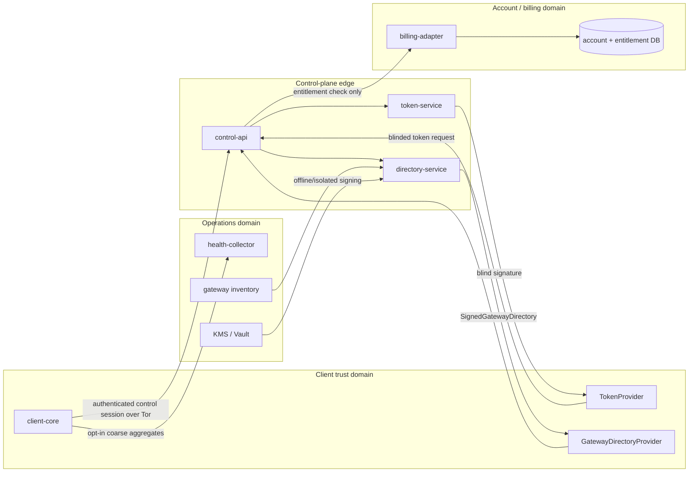
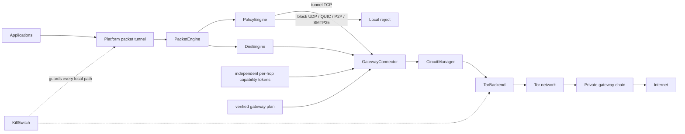
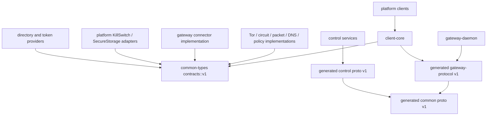
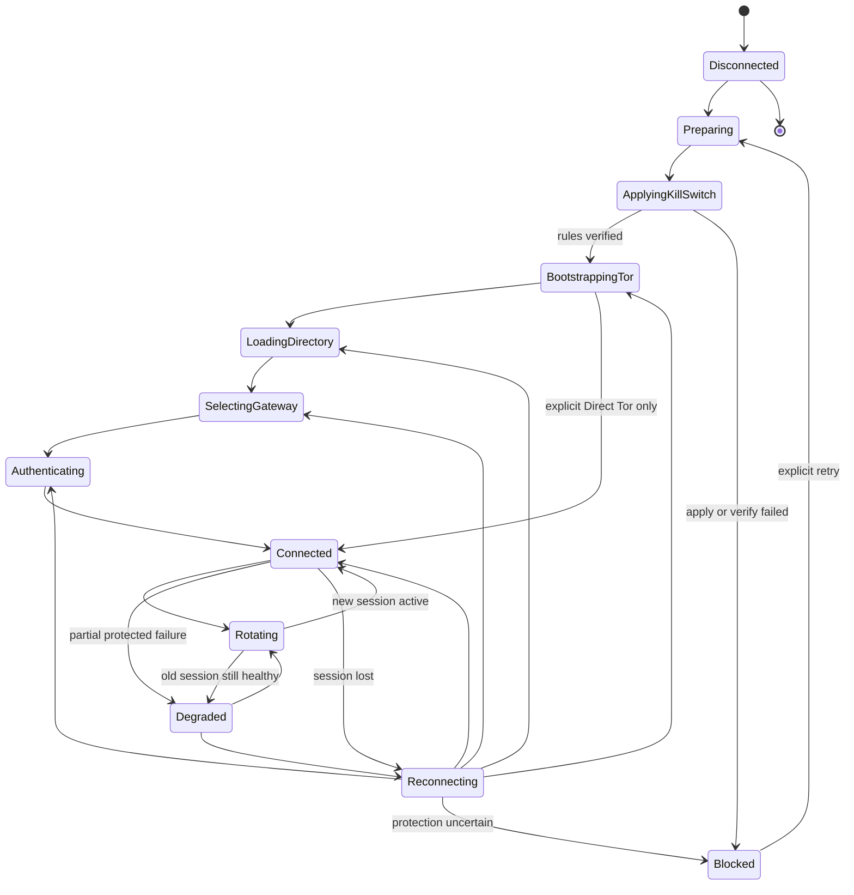
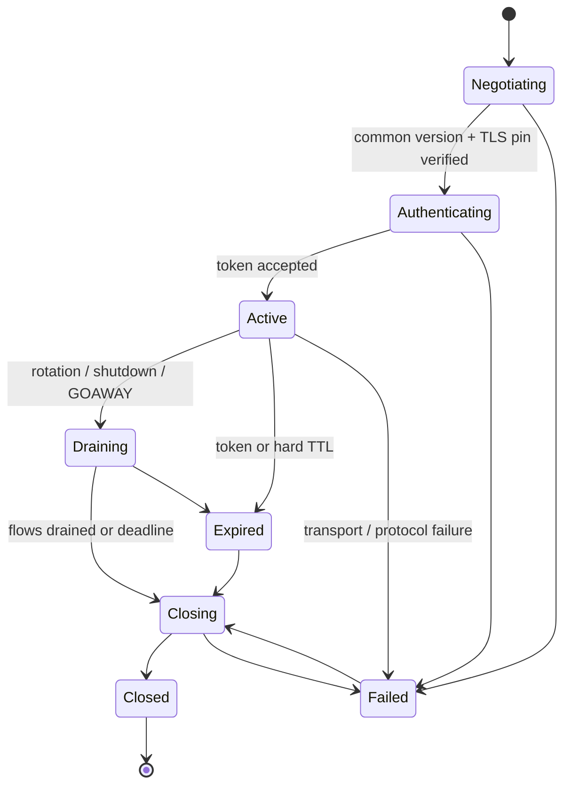

# OnionRoute: системная архитектура и интеграционные контракты

Статус: baseline v1 для параллельной разработки. Дата: 2026-07-16.

## 1. Цели и инварианты

OnionRoute перехватывает системный трафик, преобразует поддерживаемые TCP flow в
защищённые потоки и доставляет их через Tor и собственные gateway. Архитектура не
обещает абсолютную анонимность: она уменьшает коррелируемость и число сторон,
которым одновременно видны пользователь и назначение.

Обязательные инварианты:

1. После начала подключения пользовательский трафик разрешён только при
   проверенном kill switch; любой неопределённый результат означает блокировку.
2. Clearnet fallback отсутствует. Сбой Tor, DNS или gateway не ослабляет правила.
3. В MVP произвольный UDP, QUIC, BitTorrent и SMTP/25 блокируются. DNS обслуживается
   только внутри защищённого маршрута.
4. Gateway data plane не получает account ID, payment ID, device ID или реальный
   IP клиента. Он получает короткоживущий unlinkable capability token.
5. Control plane и data plane имеют раздельные API, схемы, хранилища, ключи,
   deployment-роли и телеметрию.
6. Ни один компонент не логирует назначения, DNS-имена, содержимое flow или токены.
7. Все очереди, сообщения, concurrency и сроки жизни ограничены; backpressure
   распространяется до packet engine, который отказывает новым flow fail-closed.
8. Все wire-протоколы и Rust-контракты версионированы.

## 2. Предположения и границы MVP

- Клиентское ядро — Rust library; платформенная оболочка предоставляет TUN/packet
  tunnel, secure storage и управление firewall через реализации общих traits.
- Первый Tor backend управляет C Tor. Стабильный `TorBackend` не раскрывает C API,
  поэтому Arti можно подключить без изменения `client-core`.
- Tor v3 onion authentication защищает адресуемость первого gateway; поверх неё
  используется TLS 1.3 с SPKI pin из подписанного каталога. Это разделяет Tor-
  идентичность и OnionRoute application protocol.
- В Enhanced и Maximum entry/relay пересылают opaque byte stream; terminal TLS и
  gateway application session завершаются на exit. Межgateway transport — TLS 1.3
  с взаимной аутентификацией по отдельному gateway PKI. Самодельной криптографии нет.
- Capability-token protocol использует стандартную, отдельно рецензируемую blind-
  signature/VOPRF схему. Конкретный алгоритм до security review остаётся открытым;
  gateway-контракт принимает только непрозрачный bounded token.
- Каталог доступен после bootstrap Tor. Локальный ранее проверенный каталог может
  использоваться до `valid_until`, но никогда после hard expiry.
- Bootstrap control-plane onion endpoint и его TLS trust anchor поставляются с
  подписанным client release (и могут обновляться signed policy), поэтому загрузка
  gateway directory не образует discovery cycle и не требует clearnet DNS.
- Direct Tor — явный пользовательский режим, а не fallback из private gateway mode.
- Split tunneling является локальным policy-решением. Любое bypass-правило явно,
  версионировано и не может разрешить системный DNS или запрещённый транспорт.
- Gateway не делает TLS interception и видит только необходимые destination
  metadata terminal flow; они не попадают в логи или health events.

Не входит в этот baseline: production-криптография токенов, реализация packet
reassembly, конкретные OS firewall rules, deployment, billing logic и UI.

## 3. Режимы маршрута

### Standard mode



Exit видит назначение, но получает соединение от onion service и не получает
реальный IP или account ID. Tor guard видит IP клиента, но не Internet destination.

### Enhanced mode



Entry знает только факт Tor-соединения и выбранный следующий gateway. Destination
и DNS доступны только exit внутри terminal session.

### Maximum mode



Entry и relay пересылают opaque bounded frames и не завершают пользовательские
flow. Размещение entry, relay и exit в одном failure/admin domain запрещено policy.

## 4. Control plane



Account authentication завершается на control-api. Token service подписывает
blinded request после entitlement check; он не хранит соответствие между issuance
и unblinded token. Каталог публичен, но всегда подписан. Health collector не имеет
доступа к billing/account database и принимает только закрытый набор метрик.

## 5. Data plane



Data plane не импортирует `control/v1/control.proto`. Gateway принимает локальный
ephemeral session ID и capability token; идентификаторы аккаунта отсутствуют даже
как optional/reserved semantic fields.

## 6. Границы компонентов и зависимости

`client-core` — единственный оркестратор состояния и порядка вызовов. Компоненты не
вызывают друг друга скрытно: исключения — `CircuitManager` владеет конкретным
`TorBackend`, а `DnsEngine` получает явные `GatewayConnector` и active session.

| Компонент | Ответственность | Не отвечает за |
|---|---|---|
| `client-core` | state machine, deadlines, retries, graceful shutdown | Tor internals, OS APIs, wire framing |
| `TorBackend` | bootstrap и изолированные Tor streams | gateway selection, token, policy |
| `CircuitManager` | route lease, isolation, rotation, retirement | gateway authentication, packet flows |
| `GatewayConnector` | TLS pinning, negotiation, auth, multiplexing, session lifecycle | account auth, route selection, TUN |
| `PacketEngine` | packet parsing, TCP adaptation, bounded queues | route/policy choice, system DNS |
| `DnsEngine` | DNS validation/cache и protected exchange | system resolver, direct DNS |
| `PolicyEngine` | deny rules, split tunnel, gateway plan | applying firewall rules |
| `KillSwitch` | atomic fail-closed OS rules and verification | session health, UX |
| `SecureStorage` | bounded atomic secrets and rollback state | application policy |
| `GatewayDirectoryProvider` | fetch, signature/expiry/rollback checks, cache | arbitrary gateway discovery |
| `TokenProvider` | blind issuance/unblinding/cache | forwarding account ID to gateway |
| `HealthReporter` | opt-in closed-schema aggregates | destinations, IDs, arbitrary labels |

Разрешённый dependency DAG:



`common-types` не зависит от implementations, generated protobuf, Tokio или OS API.
Запрещены зависимости gateway-daemon → control-api database и control protobuf →
gateway protobuf. Изменение стрелок требует ADR и cycle check в CI.

## 7. Процесс подключения

```mermaid
sequenceDiagram
    actor U as User
    participant C as client-core
    participant K as KillSwitch
    participant T as TorBackend
    participant D as DirectoryProvider
    participant P as PolicyEngine
    participant A as TokenProvider
    participant R as CircuitManager
    participant G as GatewayConnector
    participant E as PacketEngine

    U->>C: Connect(mode, country)
    C->>C: Disconnected → Preparing
    C->>K: recover(); engage(policy); verify(lease)
    K-->>C: verified
    C->>C: ApplyingKillSwitch → BootstrappingTor
    C->>T: bootstrap(deadline)
    T-->>C: ready
    C->>D: load_cached / refresh through Tor
    D-->>C: VerifiedGatewayDirectory
    C->>P: select_gateway_plan(directory, constraints)
    P-->>C: GatewayPlan
    par Anonymous authorization
        C->>A: acquire independent token per private hop
        A-->>C: GatewayCredentials (1/2/3 unlinkable tokens)
    and Protected route
        C->>R: prepare_route(plan)
        R-->>C: RouteLease
        C->>R: open_first_hop(route)
        R-->>C: protected byte transport
    end
    C->>G: connect(transport, plan, per-hop credentials)
    G-->>C: Active GatewaySession
    C->>E: start(platform packet tunnel, limits)
    E-->>C: running
    C->>C: Authenticating → Connected
```

Packet engine запускается только после активной gateway session; до этого kill
switch блокирует пользовательский трафик. Для Direct Tor шаги directory/token/
gateway пропускаются только по явному mode, но kill switch и Tor обязательны.

## 8. Ротация цепочки

```mermaid
sequenceDiagram
    participant C as client-core
    participant E as PacketEngine
    participant R as CircuitManager
    participant A as TokenProvider
    participant G as GatewayConnector
    participant D as DnsEngine

    C->>C: Connected → Rotating
    Note over E,G: Old route remains active; kill switch remains engaged
    par Prepare isolated route
        C->>R: prepare_rotation(old, new plan, reason)
        R-->>C: new RouteLease + first-hop transport
    and Acquire unlinkable token
        C->>A: acquire fresh independent token per new hop
        A-->>C: new per-hop credentials
    end
    C->>G: connect(new transport, new plan, new per-hop credentials)
    G-->>C: new Active session
    C->>D: flush_cache()
    C->>C: atomically mark new session default
    C->>G: begin_draining(old session)
    Note over E,G: Existing TCP flows may drain; new flows use new session
    C->>G: close(old session)
    C->>R: retire_route(old route)
    C->>C: Rotating → Connected
```

Если подготовка не удалась, но старая session здорова, состояние становится
`Degraded`, старая identity сохраняется и retry выполняется с backoff. Если старая
session тоже потеряна, выполняется `Reconnecting`; трафик остаётся заблокирован до
новой Active session. Переключение никогда не создаёт прямой маршрут.

## 9. Состояния клиента



Полный нормативный список переходов реализован в
`ClientConnectionState::can_transition_to` в `common-types`. Допустимые исходы:

| Из состояния | Разрешённые следующие состояния |
|---|---|
| `Disconnected` | `Preparing` |
| `Preparing` | `ApplyingKillSwitch`, `Disconnecting`, `FatalError` |
| `ApplyingKillSwitch` | `BootstrappingTor`, `Blocked`, `Disconnecting`, `FatalError` |
| `BootstrappingTor` | `LoadingDirectory`; `Connected` только для explicit Direct Tor; `Reconnecting`, `Blocked`, `Disconnecting`, `FatalError` |
| `LoadingDirectory` | `SelectingGateway`, `Degraded`, `Reconnecting`, `Blocked`, `Disconnecting`, `FatalError` |
| `SelectingGateway` | `Authenticating`, `LoadingDirectory`, `Degraded`, `Reconnecting`, `Blocked`, `Disconnecting`, `FatalError` |
| `Authenticating` | `Connected`, `SelectingGateway`, `Reconnecting`, `Degraded`, `Blocked`, `Disconnecting`, `FatalError` |
| `Connected` | `Rotating`, `Reconnecting`, `Degraded`, `Blocked`, `Disconnecting`, `FatalError` |
| `Rotating` | `Connected`, `Degraded`, `Reconnecting`, `Blocked`, `Disconnecting`, `FatalError` |
| `Reconnecting` | `BootstrappingTor`, `LoadingDirectory`, `SelectingGateway`, `Authenticating`, `Connected`, `Degraded`, `Blocked`, `Disconnecting`, `FatalError` |
| `Degraded` | `LoadingDirectory`, `SelectingGateway`, `Authenticating`, `Connected`, `Rotating`, `Reconnecting`, `Blocked`, `Disconnecting`, `FatalError` |
| `Disconnecting` | `Disconnected`, `Blocked`, `FatalError` |
| `Blocked` | `Preparing` после явного retry, `Disconnecting`, `FatalError` |
| `FatalError` | `Disconnecting` |

В `BootstrappingTor` и всех последующих состояниях kill switch обязателен. Выход из
`Disconnecting` в `Disconnected` возможен только после порядка: stop packet engine
→ drain/close gateway → retire circuits → shutdown Tor → disengage и verify cleanup.
Ошибка cleanup оставляет клиент в `Blocked`, а не в ложном `Disconnected`.

## 10. Lifecycle gateway session



- Session ID — 128 random bits, создаётся для одного handshake и не переживает
  reconnect. Он не является user/device ID.
- Hello согласует major/minor, features, initial flow window, max concurrent streams
  и hard TTL. Затем token проверяется до первого `OpenTcp`/`DnsQuery`.
- В multihop каждый hop имеет отдельную nested session и отдельный blind-issued token.
  Entry/relay после auth принимает только `OpenRelay(next_gateway_id, role)` и opaque
  `Data`; terminal exit принимает `OpenTcp`/`DnsQuery`. Token между hops не reuse-ится.
- `Active` принимает нечётные client stream IDs, проверяет монотонный frame sequence,
  per-stream и session-wide credit. Превышение лимита закрывает stream или session.
- `Draining` отклоняет новые flow, но bounded interval обслуживает существующие.
- Heartbeat используется только для liveness; nonce не переиспользуется как ID.
- Hard TTL равен минимуму срока token, route lease и server policy. Idle timeout не
  продлевает hard TTL. Expired session не может повторно аутентифицироваться.

## 11. Публичные контракты

Rust traits находятся в `onionroute_common_types::contracts::v1`; каждый наследует
`VersionedContract`, object-safe и не содержит platform/runtime types. Wire-контракты:

- `proto/common/v1/common.proto` — version range и безопасный `ErrorStatus`;
- `proto/directory/v1/directory.proto` — signed directory envelope/payload;
- `proto/gateway/v1/gateway.proto` — anonymous session, TCP/DNS и flow control;
- `proto/control/v1/control.proto` — directory, blind token issuance, policy;
- `proto/health/v1/health.proto` — закрытая coarse health schema.

Mocks всех 11 обязательных traits доступны с Cargo feature `test-utils`. Они
детерминированы, не обращаются к сети и предназначены для contract/integration tests.

## 12. Сквозные deadlines и backpressure

Deadline задаёт `client-core`; нижние компоненты не создают бесконечных retries.
Рекомендуемый initial budget: kill switch 5 s, Tor bootstrap 90 s, directory 15 s,
gateway select 2 s, token issuance 15 s, gateway handshake 30 s, drain 30 s. Значения
policy-configurable, но hard upper bounds обязательны.

Для каждого направления действуют: bounded packet queue, max flow count, per-flow
buffer, gateway initial window и session-wide memory budget. При насыщении чтение
приостанавливается. Новый flow получает `Backpressure`; данные не сбрасываются в
clearnet и не буферизуются без ограничения.

## 13. Открытые вопросы

1. Выбрать и пройти security review конкретной blind-signature/VOPRF схемы и
   библиотеки; до решения token implementation считается experimental.
2. Определить поддерживаемый C Tor control interface и sandbox model по платформам.
3. Утвердить минимальное число независимых gateway providers/failure domains для
   Enhanced и Maximum.
4. Определить безопасную семантику split-tunnel DNS для bypass-приложений; MVP
   рекомендует блокировать такие DNS-запросы или резолвить защищённо.
5. Утвердить TTL каталога, grace-free clock-skew policy и emergency key rotation.
6. Определить migration plan для IPv6: route через gateway либо полный block.
7. Утвердить допустимые health metrics и opt-in UX с privacy/security review.
8. Решить, нужен ли application-layer padding против traffic analysis; это не
   должно задерживать корректный bounded flow control MVP.
