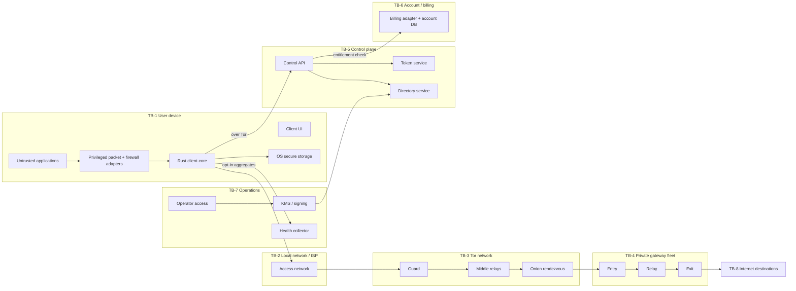

# Trust boundaries и модель доверия OnionRoute

Статус: baseline v1. Этот документ описывает, какие данные может видеть каждый
домен, где выполняется проверка и какое поведение требуется при отказе.

## 1. Защищаемые активы

| Актив | Требование |
|---|---|
| Реальный IP и сетевое положение клиента | Не передавать control/data gateway; его неизбежно видит локальная сеть и Tor guard |
| Account, entitlement и payment identity | Только account/control domain; никогда не data plane |
| Destination и DNS query | Только локальное ядро и terminal exit на время flow; не логировать |
| Traffic content | Только application и Internet peer; OnionRoute не выполняет interception |
| Capability token | Secret, одноразовый/короткоживущий, не логировать и не коррелировать с issuance |
| Directory signing roots | Pin в клиенте/secure storage; online service не может произвольно заменить root |
| Gateway TLS и inter-gateway keys | KMS/Vault, scoped по роли и окружению, с ротацией и отзывом |
| Kill-switch state | Локальный safety asset; неопределённость означает emergency block |
| Telemetry | Только закрытые coarse aggregates без идентификаторов и destination labels |

## 2. Карта trust domains

## 3. Нормативные boundaries

### TB-1a: application → privileged packet tunnel

- Приложения считаются недоверенными и могут создавать malformed, fragmented или
  resource-exhausting traffic.
- Platform adapter проверяет packet length до передачи Rust-коду; `PacketEngine`
  повторно проверяет IP/TCP/DNS bounds, fragment state и число flow.
- Application tag для split tunneling локален. Он не отправляется в gateway,
  directory, token service или telemetry.
- Любой неизвестный transport блокируется. Отсутствие parser support не означает
  bypass.

### TB-1b: unprivileged core → privileged KillSwitch/PacketTunnel

- IPC, если он нужен платформе, mutual-authenticated и length-delimited; peer
  credentials проверяются средствами OS.
- Только фиксированные policy types из `common-types` принимаются privileged helper.
  Произвольные firewall command strings запрещены.
- Helper применяет rules атомарно и возвращает generation lease. Core обязан вызвать
  независимую `verify`; timeout или crash оставляет rules engaged.
- После restart сначала вызывается `recover`, и лишь затем допускается connect/disconnect.

### TB-1c: core → secure storage

- Допускаются только ключи из закрытого `StorageKey`, не arbitrary namespace.
- Token secret, directory root и rollback sequence шифруются/защищаются OS keystore.
- Debug/Display secret types редактируются. Clipboard/export API отсутствует.
- Corruption не сбрасывает trust root автоматически: переход `FatalError` или
  безопасный пользовательский reprovisioning при сохранённом block.

### TB-2: device → local network/ISP

- Сторона видит реальный IP и факт использования Tor, но не gateway onion address,
  destination или application plaintext.
- Kill switch разрешает только Tor bootstrap traffic и строго необходимые локальные
  tunnel control paths. System DNS, QUIC и fallback блокируются.
- Captive portal handling до connect — отдельный явный workflow; автоматическое
  ослабление rules после `ApplyingKillSwitch` запрещено.

### TB-3: Tor network → v3 onion service

- Используются только v3 onion endpoints из подписанного каталога.
- `TorBackend` создаёт свежую `IsolationKey` на route/identity; ключ не происходит
  из account/device ID.
- Onion service authentication не заменяет TLS SPKI pin. Несовпадение pin —
  `GatewayIdentityMismatch`, session не создаётся.
- Tor backend не получает capability token или account state, только endpoint и
  isolation material.

### TB-4a: client terminal session → gateway chain

- Gateway frame имеет negotiated version, ephemeral session ID, monotonic sequence
  и жёсткий 64 KiB encoded limit; `Data.payload` ограничен 32 KiB.
- Entry/relay пересылают opaque terminal transport. Destination/DNS расшифровывает
  только exit. Route metadata не содержит identity.
- Каждый gateway hop принимает собственный независимо blind-issued capability token
  не более 4 KiB, проверяет expiry, scope, proof-of-possession/replay state и никогда
  не запрашивает account API в request path. Один token между hops не reuse-ится.
- Token, destination, DNS wire, session payload и onion client metadata не логируются.
- Per-stream credit, max streams, session memory budget и deadlines обязательны.

### TB-4b: inter-gateway links

- TLS 1.3 mutual authentication; identity выдаётся отдельным gateway PKI, ключи в KMS.
- Role constraints проверяются с обеих сторон: entry не становится exit по входному
  request, relay не открывает Internet sockets.
- Route связывает разные failure/admin domains по policy; health failure закрывает
  link, но не создаёт прямой обход.
- Opaque frames не обогащаются IP/account metadata. Internal source IP допустим для
  сетевой защиты, но не соединяется с client session telemetry.

### TB-4c: exit gateway → Internet

- Internet peer видит IP exit и application encryption/plaintext по исходному
  протоколу. Exit видит destination и traffic volume, поэтому является доверенным
  privacy-sensitive data processor.
- Egress policy блокирует SMTP/25, BitTorrent signatures/ports согласно policy,
  запрещённые сети, loopback/link-local/metadata endpoints и source spoofing.
- DNS выполняется тем же exit path, без системного resolver клиента.
- Flow metadata живёт только в памяти до закрытия; security logs содержат лишь
  coarse error code и gateway-local aggregate, без destination.

### TB-5: client → control plane

- Control plane доступен через Tor после kill switch. TLS server identity pinned или
  anchored в отдельном control-plane trust store.
- Account session допустима только здесь. API ограничивает request size, rate и
  lifetime, не возвращает account fields в token/directory artifacts.
- `control.proto` не импортируется `gateway.proto`; CI сканирует gateway descriptors
  на `account`, `user`, `device`, `payment`, `email`, `client_ip`, `source_ip` и
  `real_ip` identity fields. `Destination.ip_address` допустим только для terminal flow.
- Невалидный control response не влияет на уже действующую protected session.

### TB-5a/TB-6: token issuance → account/billing

- Control API проверяет entitlement и передаёт token service только разрешённый
  capability set и blinded request.
- Issuance audit содержит account-side transaction и coarse result, но не unblinded
  token. Redemption audit gateway содержит token nullifier, но не issuance reference.
- Базы issuance/account и gateway redemption физически и логически разделены;
  cross-database joins и общий correlation ID запрещены.
- Billing analytics не получает Tor/gateway/session/destination health events.

### TB-5b/TB-7: directory publisher → client

- Inventory нормализуется и проходит four-eyes approval. Isolated signer/KMS подписывает
  exact payload bytes с domain separator `onionroute-directory-v1\0`.
- Client проверяет pinned key, Ed25519 signature, envelope/format version, time window,
  monotonic sequence, gateway count, string/list bounds, onion ID и TLS pins.
- Key rotation принимается только если новый key был заранее заверен действующим key.
  Rollback sequence сохраняется атомарно в secure storage.
- Signature failure не заменяет хороший cache; hard-expired cache не используется.

### TB-7a: client/gateway → health collector

- Client telemetry выключаема и должна иметь явную product policy/consent. Схема
  закрыта enum-метриками, без arbitrary label map.
- Report nonce одноразовый, не стабильный; временные интервалы округляются. Малые
  когорты не публикуются оператору без k-threshold/aggregation policy.
- Gateway operational metrics отделены от client health ingestion. Ни одна сторона
  не отправляет destination, DNS, token, session ID, IP или account ID.

### TB-7b: operator → production/KMS

- Least privilege, MFA, JIT access, immutable audit и separation of duties.
- Directory signing, gateway TLS, token issuer и infrastructure keys различны.
- Break-glass не отключает data-plane privacy logging rules и имеет короткий TTL.
- Production secrets не копируются в CI, developer mocks или support bundles.

### TB-8: exit → arbitrary Internet

- Responses считаются недоверенными; framing/backpressure защищают gateway/client.
- SSRF-sensitive destinations и private/reserved address ranges контролируются
  policy. DNS rebinding проверяется при connect, а не только при resolve.
- Remote close, half-close и oversized response не приводят к неограниченному buffer.

## 4. Кто что может наблюдать

| Сторона | Реальный IP | Account | Gateway route | Destination/DNS | Payload |
|---|---:|---:|---:|---:|---:|
| Local application/OS | да | локально | возможно факт tunnel | собственные | собственный |
| ISP/local network | да | нет | только факт Tor | нет | нет |
| Tor guard | да | нет | нет | нет | нет |
| Tor middle/rendezvous | нет полной связи | нет | onion metadata частично | нет | нет |
| Entry gateway | нет | нет | следующий hop | нет | opaque |
| Relay gateway | нет | нет | соседние hops | нет | opaque |
| Exit gateway | нет | нет | предыдущий hop | да, volatile | по исходному application encryption |
| Control API | Tor source | да | запрошенный mode/capabilities | нет | нет |
| Token service | Tor/control source | entitlement result кратко | capability scope | нет | blinded request |
| Health collector | нет | нет | только mode/coarse result при одобрении | нет | нет |

Ни одна отдельная штатная система не должна одновременно иметь account identity,
реальный IP и destination. Компрометация клиента или глобальный passive adversary
остаётся вне обещаний полной защиты; это явно отражается в threat model и UX.

## 5. Logging и support bundles

Разрешены: component name, version, coarse state transition, стабильный `ErrorCode`,
duration bucket, queue bucket и случайный локальный correlation ID с TTL. Запрещены:
account/device/payment ID, IP, hostname, DNS wire, ports конкретного flow, onion
address выбранного gateway, token, session/route/isolation IDs, packet/payload bytes.

Support bundle создаётся только по явному действию пользователя, проходит тот же
redaction filter, показывает manifest до отправки и не включает secure storage.

## 6. Остаточные риски

- Global traffic correlation, malicious endpoint и compromised client device не
  устраняются одной маршрутизацией.
- Exit способен наблюдать destination и незашифрованный application payload.
- Entry/exit collusion снижает пользу multihop; нужны независимые failure domains.
- Blind-token anonymity зависит от корректной криптографической схемы, batching и
  отсутствия уникальных capability/timing fingerprints.
- Traffic shape и редкие маршруты могут коррелировать сессии; padding остаётся
  открытым trade-off между защитой, стоимостью и latency.
